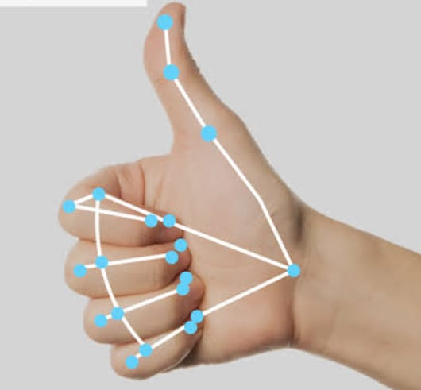

## Gesture-Controlled-Presentation
Experience seamless control over your PowerPoint presentations with our innovative gesture recognition system

# Requirements

Mediapipe:
`pip install mediapipe`

cvzone:
`pip install cvzone`

win32com:
`pip install pywin32`

opencv:
`pip install opencv-python`

aspose:
`pip install aspose-slides`

# Slides Controlling

for moving slides to previous

for moving the slides to next

